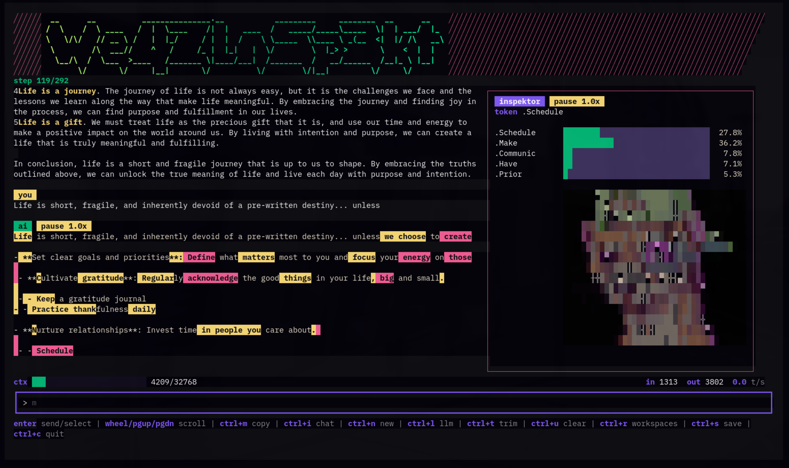

# WeazlInspekt



WeazlInspekt is the diagnostic, bare-metal overlay for local LLM work. Think of it as an X-ray machine for the latent space.

It is a straightforward, distraction-free terminal interface for interacting with local models, but with an Inspektor pane that shows exactly what those models are doing as they generate text. There is no magic in the machine. There are only probability distributions. WeazlInspekt splits your terminal to visualize that reality in real time.

## The Philosophy

When you spend hours interacting with an aligned LLM, it is easy to anthropomorphize the output. The model generates a profound statement, and the human brain naturally assumes the machine possesses a worldview or an understanding of consequence.

WeazlInspekt strips away the conversational wrapper and exposes the raw mathematical engine underneath. By intercepting `logprobs` from a local OpenAI-compatible vLLM endpoint, it visualizes the exact token-by-token probability math the model is executing. You do not see an entity making a decision; you see a statistical engine weighing vectors.

## The Split View

Press `ctrl+i` from inside the chat view to toggle Inspekt Mode. Your viewport immediately splits into a two-pane diagnostic layout:

- Left pane, the Transcript: the normal message thread. During Inspekt playback, the currently active token is distinctly highlighted so your eyes can track the model's exact position in the sequence.
- Right pane, the Inspektor: the real-time logit inspector. With every incoming SSE chunk, this pane updates to show the mathematical reality of the highlighted token. You get a stark, cyberpunk-styled bar chart showing the top alternatives the model considered, converted dynamically from raw log probabilities into human-readable percentages: `P = e^logprob * 100`.

## Hesitation Markers And Playback

WeazlInspekt is not just a chart; it is a window into model entropy.

LLMs are heavily fine-tuned to project high confidence. But when you ask a model an existential question, or force it into a logical corner, the math can fracture. WeazlInspekt visualizes this entropy using hesitation markers:

- Solid green: the model is highly confident. Usually seen on structural syntax, common idioms, or obvious continuations.
- Warning yellow and alert magenta: the model is mathematically torn. The probabilities split into contested distributions, drawing your eye to the exact moment a profound turn of phrase was actually a tight statistical coin toss.

The Inspektor pane also renders a `top-k entropy` gauge and a short entropy trace. Low entropy means the visible alternatives are concentrated around one obvious token. High entropy means the returned alternatives are spread across competing continuations. The trace shows recent entropy momentum ending at the current playback cursor. This is a top-k diagnostic, not a full-vocabulary entropy claim.

Press `ctrl+l` while Inspekt Mode is active to toggle the value column between percentages and raw `logprob` values. The API does not expose true pre-softmax logits, so the UI labels this mode accurately as `logprob`.

Want to analyze a generation closely? Inspekt Mode buffers the token stream into RAM and starts playback at `0.1x` so the stream is readable. Press `'` to cycle playback speed through `0.1x`, `0.5x`, `1.0x`, and step mode. Press `[` to step back one token and `]` to step forward one token. The transcript and Inspektor stay synchronized so the highlighted token and probability chart represent the same model state.

## Immutable Vault Integration

WeazlInspekt does not just show you the math; it records it.

Because it uses AES-GCM encrypted SQLite vaults, WeazlInspekt extends the database schema to capture the highest-entropy logit splits during a conversation. When you save a workspace with `ctrl+s`, the Vault retains that mathematical hesitation. You can pull up a saved chat from three months ago and see exactly where the model's token predictions began to drift.

## API Requirements

WeazlInspekt requires an endpoint that supports streaming log probabilities for the full Inspektor experience.

- vLLM: fully supported through the OpenAI-compatible `/v1/chat/completions` endpoint. WeazlInspekt sends `logprobs: true` and `top_logprobs: 6`, parses `choices[0].logprobs.content[0].top_logprobs`, and converts each raw log probability with `math.Exp(logprob) * 100`.
- Ollama: chat and tool use are supported, but logprob visibility depends on the Ollama API and model exposing token probability metrics.
- `top_p`: for the clearest visual results, use `top_p: 1.0` on your serving stack so the probability distribution is not truncated before it reaches the client.

## Defaults

On first launch, WeazlInspekt drops a fresh `config.json` into the local app config directory with sensible defaults:

- Linux/macOS: `~/.config/weazlinspekt/config.json`
- Windows: `%APPDATA%\weazlinspekt\config.json`

- `local-vllm`: `http://localhost:8000`
- model: `local-model`
- `local-ollama`: `http://localhost:11434`

Because hardcoding endpoints into a client is a terrible idea, WeazlInspekt reads the endpoint and model from the config at runtime.

## Run

```sh
go run ./cmd/weazlinspekt
```

## Install

```sh
./scripts/install.sh
```

On Windows, run the PowerShell installer:

```powershell
powershell -ExecutionPolicy Bypass -File .\scripts\install.ps1
```

The installer takes care of the heavy lifting. On Linux/macOS it builds `weazlinspekt`, tucks it into `~/.weazlinspekt/bin`, and adds that directory to your shell `PATH` if it is not already present. On Windows it installs to `%APPDATA%\weazlinspekt\bin`, adds that directory to your user `PATH`, and keeps config, build cache, history, workspace saves, and vault data under `%APPDATA%\weazlinspekt`.

During setup, you will be prompted for your provider type and URL. The script queries the provider for available models, optionally takes your tool API keys, writes the platform config file, and boots straight into the TUI.

Provider URL rules: base URLs only, please.

- vLLM: `https://host:port` or `https://host`, without `/v1`
- Ollama: `http://host:11434`, without `/api`

If you accidentally paste the `/v1` or `/api` suffixes, the installer quietly fixes them for you. Tool API keys are optional: leave a prompt blank to keep an existing key, or type `-` to clear it.

The installer also asks for a context window preset:

- `small`: `8192` tokens
- `medium`: `16384` tokens
- `large`: `32768` tokens
- `xl`: `128000` tokens; heads up, this may cause out-of-memory errors on smaller local servers

Finally, the first run asks you to set a local history password. Session history and workspace saves are stored in SQLite with a password-protected vault and AES-GCM encrypted payloads.

Markdown rendering is enabled by default with Charmbracelet Glamour, so model output keeps its terminal-native shape: headings, lists, code blocks, links, quotes, and tables all get a little polish without turning the app into a browser.

## Build From Source

WeazlInspekt is a Go app, but it uses SQLite through `go-sqlite3`, so builds need Go 1.25 or newer, CGO, and a working C compiler. That is the one little bit of yak hair.

### macOS

Install Go and the Xcode command line tools:

```sh
xcode-select --install
```

Then build:

```sh
go build -o weazlinspekt ./cmd/weazlinspekt
go build -o weazlinspekt-setup ./cmd/weazlinspekt-setup
```

The install script also works on macOS-style shells:

```sh
./scripts/install.sh
```

### Windows

The first-class Windows installer can bootstrap the build dependencies with `winget`, build the app, add it to your user `PATH`, run setup, and launch WeazlInspekt:

```powershell
powershell -ExecutionPolicy Bypass -File .\scripts\install.ps1
```

It installs the executable to `%APPDATA%\weazlinspekt\bin\weazlinspekt.exe`. Config and local history live under `%APPDATA%\weazlinspekt`, so Windows does not need Unix-style dot directories.

If you want to install the dependencies yourself, install Go for Windows and a C compiler that Go can use with CGO. MSYS2 works well:

1. Install MSYS2 from https://www.msys2.org/
2. Open the MSYS2 UCRT64 shell.
3. Install the compiler:

```sh
pacman -S --needed mingw-w64-ucrt-x86_64-gcc
```

Make sure the UCRT64 `bin` directory is on your `PATH`, then build from PowerShell or the MSYS2 shell:

```sh
go build -o weazlinspekt.exe ./cmd/weazlinspekt
go build -o weazlinspekt-setup.exe ./cmd/weazlinspekt-setup
```

Run setup first if you want the guided config flow:

```sh
.\weazlinspekt-setup.exe
.\weazlinspekt.exe
```

## Keys

- `enter`: send message / select session
- `up` / `down`: recall previous prompts in the current session
- mouse wheel: scroll chat history
- `pgup` / `pgdown`: scroll chat history
- `home` / `end`: jump to top or bottom of chat history
- `ctrl+m`: toggle between copy mode and mouse scroll mode
- `ctrl+i`: toggle Inspekt Mode
- `tab`: toggle Inspekt Mode; many terminals send `ctrl+i` as Tab
- `'`: cycle Inspekt playback through `0.1x`, `0.5x`, `1.0x`, and step mode
- `[`: step Inspekt playback back one token
- `]`: step Inspekt playback forward one token
- `ctrl+g`: toggle the Inspekt die-roll indicator
- `ctrl+l`: toggle Inspekt values between `%` and `logprob`; outside Inspekt Mode, open LLM config
- `ctrl+n`: start a new session
- `ctrl+r`: open workspace saves
- `ctrl+d`: delete the selected workspace save from the picker
- `ctrl+e`: rename the active or selected workspace save; from chat, this creates the save first if needed
- `ctrl+s`: save current workspace view
- `ctrl+w`: open workspace saves
- `ctrl+t`: trim context into a summary checkpoint
- `ctrl+u`: clear the active session context after confirmation
- `esc`: back to chat
- `ctrl+c`: quit

## Inspekt Mode

Press `ctrl+i` or `tab` in chat to split the TUI into two panes:

- Left pane, the Transcript: the normal message thread. During Inspekt playback, the active token is highlighted and persistent hesitation markers remain visible throughout the session.
- Right pane, the Inspektor: the current generated token plus a top-5 probability bar chart backed by a top-6 logprob capture for die-roll detection.

For vLLM/OpenAI-compatible streaming, WeazlInspekt sends `logprobs: true` and `top_logprobs: 6` with chat completion requests. Each incoming log probability is converted with `math.Exp(logprob) * 100` and displayed immediately through BubbleTea messages, keeping stream updates on the normal TUI event path.

In Inspekt Mode, prompts are stateless by design. The current prompt is sent without prior session context so old conversation history does not poison the probability demonstration.

### Inspektor Evidence

The Inspektor pane marks the probability evidence directly in the token bars:

- `★`: the highest-probability token returned by the model server
- `▶`: the token the sampler actually generated
- `▶★`: the generated token was also rank 1

When `▶` and `★` appear on different rows, the model sampled a non-argmax token. With die-roll mode enabled, WeazlInspekt labels that event with `[DIE ROLL]` and renders a static ASCII die in the pane. Press `ctrl+g` to toggle this diagnostic layer on or off; the title line shows `die on` or `die off`.

The entropy section adds two views of uncertainty:

- `entropy`: the normalized Shannon entropy of the visible top-k alternatives for the active token
- `trace`: a short cursor-synced history of recent entropy, ending at the current playback token

The trace follows stepping and rewind. If you step back five tokens, the entropy trace rolls back with the transcript and the active probability chart.

Press `ctrl+l` while Inspekt Mode is active to toggle the numeric value column between `%` and `logprob`. Outside Inspekt Mode, `ctrl+l` still opens LLM configuration.

The vault stores high-entropy token splits in `messages.logit_splits` whenever the top two alternatives are less than 10 percentage points apart. That makes later SQLite queries useful without saving every routine token choice.

## Telemetry And Context Trimming

The status line at the bottom of the viewport gives you the vitals on your local inference. Alongside a Bubble Charm progress bar showing estimated context usage, you get token counts (`in` and `out`) and current generation speed in tokens per second (`t/s`).

The provider's `context_window` lives in your platform config file; it defaults to `32768` tokens, or whatever preset you chose during install.

Running out of room? Press `ctrl+t` to have the active model summarize the current conversation into a compact checkpoint. The summary target scales with your configured context window, bounded between 500 and 6000 tokens. Future requests send that checkpoint summary plus only the new messages, saving your hardware from replaying the entire session from the top.

If you forget, WeazlInspekt has your back. It automatically trims context using opinionated working-context thresholds: small windows run close to the edge, while large windows compact much earlier so 128k context stays useful headroom instead of a giant prompt tax. Your current prompt stays outside the checkpoint and is sent normally right after the trim finishes.

Need a truly clean slate inside the current session? Press `ctrl+u` and confirm. That clears the active messages, tool-call history, and context checkpoints from SQLite for the current session, resets the context meter, and leaves you at a fresh prompt without guessing whether old history is still in play.

## TUI Feedback

While you wait for inference, WeazlInspekt uses Bubble spinner animations with rotating status phrases such as `hacking_the_gibson`, `jacking_into_the_matrix`, `wheezing_the_juice`, and `chilling_the_tokens`. The phrases favor active `-ing` wording, stay stable for short responses, and swap just a couple of times during longer generations to keep the screen quiet.

Tool calls stay neatly tucked away in the transcript as `🔧 using tools`. WeazlInspekt keeps the raw tool-call bookkeeping in encrypted history so the model can continue correctly, but hides empty assistant/tool scaffolding from the visible chat. When WeazlInspekt is summarizing older history into a checkpoint, it uses a distinct compaction animation so you know it is trimming context rather than hanging on a standard response.

Assistant responses are rendered with Glamour-powered Markdown once they land in the transcript, including when you resume a session or replay a saved workspace. Streaming text stays simple while it is still arriving, then gets cleaned up after the response is saved.

Workspace saves are meant to feel like quick snapshots, not a filing chore. Press `ctrl+s` to save or update the current workspace view, then use `ctrl+r` or `ctrl+w` to open the picker. In the picker, saves are ordered by creation time but displayed as `workspace name: timestamp` so the useful part is first. Press `ctrl+e` from chat to create/rename the active workspace, or press `ctrl+e` in the picker to rename the selected save. Press `ctrl+d` in the picker to delete a workspace save from SQLite without deleting the underlying chat session.

You can tune or disable Markdown rendering in your platform config file:

```json
{
  "ui": {
    "resume_last_session": true,
    "render_markdown": true,
    "markdown_style": "dark"
  }
}
```

`markdown_style` accepts Glamour standard style names. WeazlInspekt defaults to `dark`; `auto` is treated as `dark` to avoid terminal color-query responses leaking into the input box in some terminals.

## Scrolling And Copy/Paste

Mouse wheel scrolling is enabled by default to make reviewing long conversations easy. Because the TUI has to capture the mouse to do this, standard terminal text selection can be intercepted.

You have two ways to grab text:

1. Toggle mode with `ctrl+m`: hit `ctrl+m` to enter copy mode. This releases mouse capture so your terminal can highlight and copy normally. Hit it again to go back to scrolling. The help line updates dynamically to show `ctrl+m copy` or `ctrl+m mouse`.
2. Use `shift` + drag: depending on your terminal emulator, holding `shift` while dragging often bypasses TUI mouse capture entirely, letting you highlight text without switching modes.

Large pasted blocks are stored as the full prompt payload under the hood, but displayed compactly in the input bar as `[PASTED n lines]` to keep your view tidy.

## Tool Support

WeazlInspekt is not just a static chat window. It supports function calling tools that let the AI model interact with external services and your local workspace. Tools execute automatically when allowed by their safety level.

Important: tools only work with models that understand function/tool calling. If your model does not support tool calls, normal chat still works, but WeazlInspekt cannot reliably ask it to run web search, weather, file, shell, SQLite, memory, or other tools. Use a tool-capable local model for the fun stuff.

### Enabling Tools

The installer can write this section for you, but to edit it manually, update your platform config file:

```json
{
  "tools": {
    "enabled": true,
    "auto_execute_safe": true,
    "alpha_vantage_api_key": "YOUR_ALPHA_VANTAGE_API_KEY_HERE",
    "brave_api_key": "YOUR_BRAVE_API_KEY_HERE",
    "workspace_roots": ["/home/user/Code", "/home/user/Notes"],
    "max_output_chars": 12000,
    "max_file_bytes": 1048576
  }
}
```

Configuration options:

- `enabled`: flip to `true` to turn on tool support; default is `false`
- `auto_execute_safe`: automatically run safe tools without asking for confirmation; default is `true`
- `alpha_vantage_api_key`: API key for stock price lookups; optional
- `brave_api_key`: API key for Brave web search lookups; optional
- `workspace_roots`: restricted directories that file, shell, and SQLite tools are permitted to read from
- `max_output_chars`: maximum characters returned by tools before they are truncated
- `max_file_bytes`: maximum file size for local search/read tools

### Available Tools

#### General Utilities

- Calculator: standard math: add, subtract, multiply, divide, power, sqrt, percentage. Always available when tools are enabled.
- Current time: local machine date/time or specific IANA timezones. Always available when tools are enabled.
- Weather: current weather and short forecasts with Open-Meteo. Always available when tools are enabled, no API key required.
- Markdown checker: renders supplied Markdown with Glamour and returns a short pass/fail preview. Always available when tools are enabled.
- Stock price: current stock prices and market data. Requires Alpha Vantage API key.
- Web search: Brave Search queries returning titles, URLs, snippets, and dates. Requires Brave API key.
- Fetch URL: grabs HTTP/HTTPS URLs and returns readable text. Private and local network addresses are rejected.

#### Local Workspace

Workspace tools only operate under configured `workspace_roots`.

- Local files: `list_files`, `search_files`, `read_file`, `create_file`.
- Read-only command: runs a tight allowlist of read-only commands such as `pwd`, `ls`, `find`, `rg`, `cat`, `git status`, `git diff`, `git log`, `git show`, `go test`, and `npm test`. Commands are passed safely as args, never as raw shell strings.
- SQLite query: executes read-only queries against local database files. Allowed SQL starts with `SELECT`, `WITH`, `EXPLAIN`, or `PRAGMA table_info`.
- Local memory: encrypted local memory storage with `remember`, `recall`, `list_memories`, and `forget`.

`create_file` only creates new text files under `workspace_roots`; it flat out refuses to overwrite existing files.

### How It Works

1. You ask a question that requires a tool, and the AI model automatically calls the right function.
2. Tool payloads stay hidden from the main chat transcript.
3. The result is fed back to the model to synthesize a natural language response.
4. Calls, results, history, and memories are stored in your local SQLite vault.

### Model Requirements

- vLLM: the loaded model must support function calling, such as models fine-tuned for tool use.
- Ollama: you need a model with native tool support. Good starting points include `llama3.1`, `mistral-nemo`, and `qwen2.5`.

### Security

We take local privacy seriously, but this is still a small local app, not a hardware security module. Your vault is only as good as the password you choose. The bcrypt password check and encrypted payloads are there to keep casual prying eyes out; they are not a promise that a weak password will survive a determined offline attack against your database.

- Safe tools are strictly read-only, create-only for text files, or explicit local memory operations.
- File, shell, and SQLite tools are boxed into configured `workspace_roots`.
- `create_file` will never overwrite existing files.
- Shell commands are allowlisted and do not execute through an actual shell.
- URL fetching actively blocks private and local network IP addresses.
- Tool output is truncated before returning to the model to prevent massive context floods.
- Tool execution happens locally inside the WeazlInspekt process.
- API keys live in your local config file and are never shared by WeazlInspekt.
- Chat history, tool interactions, and memories are encrypted in your local database.

### Example Config

Check out `config.example.json` for a complete configuration template with tools enabled.

## License And Branding

WeazlInspekt is released under the MIT License. Use it, fork it, ship it, learn from it.

The `WeazlInspekt` name, screenshot, and project branding are part of this project identity. If you publish a substantially modified fork, please use a different name and visual branding so users can tell the projects apart.
